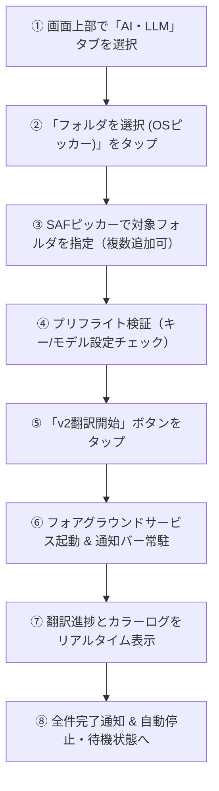
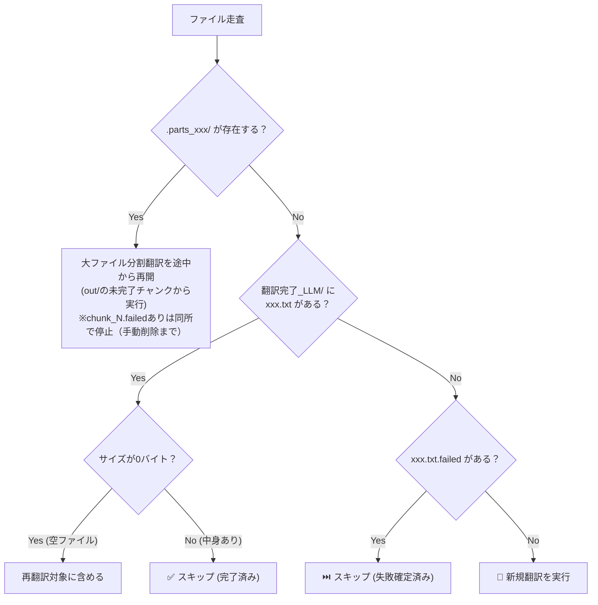

# NovelScraper2 — LLM翻訳（v2エンジン）動作仕様・振る舞いガイド

本書は、NovelScraper2における **LLM翻訳機能（v2エンジン）** の表面的な振る舞い、画面操作、ファイル・フォルダ構造の変遷、および内部処理フローをまとめた技術・運用解説ドキュメントです。
初めて本リポジトリに触れる開発者や利用者が、アプリが裏側で何を行っているかを直感的に理解できるように構成されています。

旧 `translation/llm/` 直下の文書（動作メモ・振る舞い仕様・アーキテクチャ仕様書）に残っていた有効な規則は本書に統合済みです。旧実装のクラス名・閾値の記述は現行v2に合わせて更新されています。
なお数値（サイズ比・件数・閾値・上限）はコード定数・設定画面が正本であり、本書の数値はすべて理解用の例です。ここに複写された数値を正として実装しないでください。

---

## 目次

1. [全体の概要と特徴](#1-全体の概要と特徴)
2. [操作手順と表面的な振る舞い（UI・通知）](#2-操作手順と表面的な振る舞いui通知)
3. [フォルダ・ファイル全体のライフサイクル変遷](#3-フォルダファイル全体のライフサイクル変遷)
4. [詳細動作と内部ファイルツリー](#4-詳細動作と内部ファイルツリー)
   - [4.1 巨大ファイルの事前物理分割 (PreSplit)](#41-巨大ファイルの事前物理分割-presplit)
   - [4.2 言語自動判定とキャッシュ (.lang_cache)](#42-言語自動判定とキャッシュ-lang_cache)
   - [4.3 登場人物辞書生成 (.dict_building → dictionary.json)](#43-登場人物辞書生成-dict_building--dictionaryjson)
   - [4.4 大ファイル分割翻訳 (.parts_xxx/ → ストリーミング結合)](#44-大ファイル分割翻訳-parts_xxx--ストリーミング結合)
   - [4.5 バッチ翻訳・単体翻訳と失敗ファイル (.failed)](#45-バッチ翻訳単体翻訳と失敗ファイル-failed)
5. [品質検査とモデル巡回 (Rotation)](#5-品質検査とモデル巡回-rotation)
6. [中断とレジューム（再開時の判定ルール）](#6-中断とレジューム再開時の判定ルール)
7. [不変条件・運用ルール](#7-不変条件運用ルール)

---

## 1. 全体の概要と特徴

NovelScraper2のLLM翻訳は、Google GeminiやOpenRouter（Claude / OpenAI / DeepSeek等）のAPIを活用し、長編・短編小説のテキストファイルを日本語へ高精度に翻訳するエンジンです。

* **耐障害性（Fail-Safe）**: 1つのファイルやパートが失敗しても、小説全体の翻訳を中断させずに後続を継続。
* **完全レジューム**: アプリの強制終了や中断があっても、次回起動時は完了済みファイルをスキップし、大ファイルの途中チャンクから再開。
* **動的キャパシティ制御**: モデルの最大出力トークン数から安全な入力バイト数を逆算し、「単体翻訳」「バッチ翻訳」「大ファイル分割翻訳」を自動選択。
* **文脈接続（Context Injection）**: 直前話の原文末尾や直前チャンクの確定訳文を自動注入し、エピソード間の不自然な語調変化を防止。
* **バックグラウンド実行**: Androidのフォアグラウンドサービスと連携し、通知バーで進捗を確認・停止可能。
* **文字化けスキップ**: 文字コード判定に失敗したファイルは翻訳せずスキップし、化けた訳文を作らない。

---

## 2. 操作手順と表面的な振る舞い（UI・通知）



1. **エンジンタブ選択**:
   画面の「自動翻訳 (Web / AI・LLM)」パネルで **「AI・LLM」** タブを選択すると、エメラルドグリーンの「LLM翻訳 v2」パネルが開きます。
2. **フォルダ選択**:
   「フォルダを選択 (OSピッカー)」または「＋ 追加」をタップし、Android標準のSAF（Storage Access Framework）経由でフォルダを指定します。複数フォルダの一括キューイングや、個別解除（`×`）、全解除に対応しています。
3. **開始前チェック（プリフライト判定）**:
   開始条件を満たさない設定は開始を止めます（例: モデル未登録、Gemini利用なのにGeminiキー未設定、OpenRouter利用なのにOpenRouterキー未設定、辞書ONなのに辞書モデル未設定、プロンプト番号が1〜7以外）。一方、モデル未対応のパラメータ（例：非対応モデルの思考レベル、範囲外の温度）は**警告のみで開始は止めません**。送信時に落とす・丸める・送らない処理が入るためです。
4. **翻訳開始と通知**:
   「v2翻訳開始」を押すと即座にフォアグラウンドサービスが起動。通知バーに進捗（`処理中: 第01章.txt (1/50)`）と停止ボタンが表示され、画面オフやバックグラウンドでも安定動作します。
5. **進捗・ログ表示**:
   全体進捗、大ファイル進捗、処理中ファイル名、および最新200件の色分けされた絵文字ログ（✅ 成功、❌ 失敗、⚠️ 警告、🔄 切替、📦 バッチ/大ファイル）がリアルタイム表示されます。「全ログコピー」でクリップボードへ一括書き出しが可能です。

---

## 3. フォルダ・ファイル全体のライフサイクル変遷

翻訳の進行に伴い、選択されたフォルダ内は次のように変化します。

### ① フォルダ選択直後（初期状態）
元の生テキストファイルのみが存在する状態です。
```
[選択したフォルダ]
 ├─ 001.txt
 ├─ 002.txt
 └─ 単一長編ファイル.txt       ← (1冊丸ごとなど巨大ファイルがある場合)
```

### ② 翻訳実行中（一時作業フォルダが展開された状態）
裏側で各機能が稼働し、ドット（`.`）から始まる一時作業フォルダが自動生成されます。
```
[選択したフォルダ]
 ├─ 001.txt
 ├─ 002.txt
 ├─ 単一長編ファイル.txt
 ├─ .lang_cache               ← 言語判定結果を即時保存 (ZH/KO/EN/JA)
 ├─ .dict_building/           ← 辞書生成中の一時作業所 (完了後に自動消去)
 ├─ 分割済み/                 ← 巨大ファイルを扱いやすいサイズに事前分割
 │   └─ 単一長編ファイル/
 │       ├─ part_0001.txt
 │       └─ part_0002.txt
 └─ 翻訳完了_LLM/             ← 成果物フォルダ
     ├─ 001.txt               ← 翻訳完了したファイル
     └─ .parts_002.txt/       ← 大ファイル分割翻訳中の一時作業所
```

### ③ 翻訳完了後（クリーンアップされた状態）
すべての一時作業フォルダが自動消去され、成果物と辞書のみが美しく整頓されて残ります。
```
[選択したフォルダ]
 ├─ 001.txt
 ├─ 002.txt
 ├─ 単一長編ファイル.txt
 ├─ .lang_cache               ← 次回以降の再判定コストを省くため保持
 ├─ dictionary.json           ← 完成した登場人物対訳辞書
 ├─ 分割済み/                 ← (元が巨大ファイルだった場合、各パートの翻訳先はここ)
 │   └─ 単一長編ファイル/
 │       ├─ part_0001.txt
 │       ├─ part_0002.txt
 │       └─ 翻訳完了_LLM/     ← パート別の翻訳成果物
 └─ 翻訳完了_LLM/
     ├─ 001.txt               ← ✅ 翻訳成功
     ├─ 002.txt               ← ✅ 結合・翻訳成功
     └─ 003.txt.failed        ← ❌ 万一全滅した場合のみ (後続を止めない)
```

---

## 4. 詳細動作と内部ファイルツリー

### 4.1 巨大ファイルの事前物理分割 (PreSplit)

1ファイル数十万文字に達する単一のWeb小説ファイルは、1箇所の失敗でファイル全体が未完了になるのを防ぐため、事前に物理分割します。

```
[対象フォルダ]
 ├─ huge_novel.txt            ← 【読込のみ】元のファイルは一切変更・上書きしない
 └─ 分割済み/                 ← 新規作成
     └─ huge_novel/           ← 小説名のサブフォルダ
         ├─ part_0001.txt     ← 指定文字数（約7,000字）ごとに分割（文字化け自動検査済）
         ├─ part_0002.txt
         ├─ part_0003.txt
         └─ 翻訳完了_LLM/     ← 分割完了後、自動的にこのフォルダの翻訳がスタート
             ├─ part_0001.txt
             └─ part_0002.txt
```
* **振る舞い**: ログに `📄 物理分割中: huge_novel.txt` ➜ `🚀 分割完了・翻訳開始: huge_novel (15 パート)` と表示され、分割先サブフォルダの翻訳へ自動移行します。親フォルダ直下の元ファイル自体は翻訳しません。
* **言語判定用サンプル**: 新規分割時は全文ではなく先頭抜粋（約8,000字）を言語判定に渡します。再開時（先頭パート読み直し）と一致させるためです。
* **文字化けスキップ**: 文字コード判定に失敗したファイルや、分割片に文字化けが検出されたファイルは**翻訳せずスキップ**します（ログに `⏭️ 文字化けのため翻訳しません: ファイル名`）。通常翻訳の経路にも回さないため、化けた訳文が完成することはありません。全件が該当した場合はその旨をログに出して終了します。
* **再開**: 分割済みパートが残っていれば作り直さず再利用します（分割サイズ設定を変えても既存パートは維持されます）。
* **安全性**: 処理途中でユーザーが停止した場合、中途半端な分割フォルダは自動でロールバック（消去）されます。

---

### 4.2 言語自動判定とキャッシュ (.lang_cache)

翻訳プロンプト（中国語用、韓国語用、英語用）や文字数許容量を正しく切り替えるため、本文サンプルから言語を自動判定します。

```
[対象フォルダ]
 └─ .lang_cache               ← 中身は "ZH", "KO", "EN", "JA" のいずれか1行のみ
```
* **振る舞い**: 先頭ファイル群からの冒頭サンプル（約1,200文字）から判定し、`detected language: ZH` とログ出力。簡体字・ハングル・かな等の決定論的特徴で判定し、短文や境界例はフォールバックで拾います。
* **高速化と固定**: 判定結果は `.lang_cache` に保存され、次回以降は再判定せず即座に翻訳へ入ります。ファイル追加後も貼り付く仕様です（単一言語フォルダ前提）。事前物理分割から引き継いだ場合は再判定せず値を引き継ぎます。

---

### 4.3 登場人物辞書生成 (.dict_building → dictionary.json)

辞書機能がONの場合、小説全体をサンプリング走査してキャラクター名・性別・読み（カタカナ）をAIで抽出し、用語集を作成します。

```
[対象フォルダ]
 ├─ .dict_building/           ← 【作業中のみ出現】
 │   ├─ manifest.json         ← 各バッチのハッシュ管理（中断時の重複計算防止）
 │   ├─ batch_0001.json       ← サンプリングから抽出した用語断片
 │   └─ batch_0002.json
 │       ※統合・マージとレビューはファイルに残らずメモリ上で行われます
 │
 └─ dictionary.json           ← 【完成時に直下へ公開】
                              ←  同時に「.dict_building/」は自動消去される
```
* **振る舞い**: 画面ステータスに `📖 登場人物辞書を生成中: フォルダ名` と表示。抽出（各バッチ断片の統合）→レビュー（地名・組織名・一般名詞の除去）の2段階で精度を担保します。
* **レジューム**: 中断された場合でも `batch_xxxx.json` が残るため、次回は未完了バッチから差分生成されます。
* **部分確定**: 一部バッチだけ確定的に失敗した場合は成功分で統合して確定します。一時的失敗（制限等）が混ざる場合は保留し、次回に持ち越します（この間フォルダ全体の翻訳は待ちます）。
* **空辞書**: 人名が1人も出ない本では空のまま完成扱いにし、保存・再利用します（毎回の再生成ループにしません）。
* **OpenRouter辞書**: Geminiキーなし・OpenRouter単独構成でも動作します（Gemini枠を使いません）。
* **失敗時**: 辞書が未完成のままの場合はフォルダ全体をスキップします（辞書なし続行はしません）。

---

### 4.4 大ファイル分割翻訳 (.parts_xxx/ → ストリーミング結合)

1話の長さがモデルの出力許容量を超える中〜大サイズのエピソード（例: 2万〜4万バイト以上）は、内部でチャンク分割翻訳され、最後に結合されます。

```
[対象フォルダ]
 ├─ episode_long.txt          ← 原文
 └─ 翻訳完了_LLM/
     ├─ .parts_episode_long.txt/  ← 【作業中のみ出現】
     │   ├─ in/                   ← 原文を安全なサイズに切り分けたチャンク
     │   │   ├─ chunk_0001
     │   │   ├─ chunk_0002
     │   │   └─ chunk_0003
     │   └─ out/                  ← 翻訳済みのチャンク
     │       ├─ chunk_0001        ← 直前話の原文末尾を注入して翻訳
     │       ├─ chunk_0002        ← chunk_0001の「訳文末尾」を数珠つなぎ注入
     │       └─ chunk_0003        ← chunk_0002の「訳文末尾」を数珠つなぎ注入
     │
     └─ episode_long.txt      ← 【全チャンク完了時にストリーミング結合して書き出し】
                              ←  同時に「.parts_episode_long.txt/」は自動消去される
```
* **振る舞い**: 画面に **`大ファイル進捗: 2 / 3 チャンク`** と表示。
* **文脈接続**: チャンク境界で文脈が途切れないよう、先行チャンクの訳文末尾N行を後続チャンクのプロンプトへ自動注入（前文脈設定OFFでも話内のつなぎだけは維持します）。
* **末端吸収**: 末尾の微小な余りは独立リクエストの浪費を避けるため直前チャンクへ合体します。
* **再開性**: 途中で停止しても `out/` の完成チャンクは保護され、次回は未完了チャンクからピンポイント再開します。
* **失敗時**: 失敗したチャンクは `out/chunk_N.failed` の印だけ残し、親に `.failed` は作りません。印がある間は同じ所で停止するため、再開には印の手動削除が必要です（自動再試行しません）。

---

### 4.5 バッチ翻訳・単体翻訳と失敗ファイル (.failed)

通常サイズのファイルは、並列ワーカーが「単体翻訳」または「バッチ翻訳」で並行処理します。

```
[対象フォルダ]
 ├─ 001.txt ──┐
 ├─ 002.txt ──┼─ (短い章が連続) ➔ 1リクエストに束ねてバッチ翻訳
 ├─ 003.txt ──┘
 ├─ 004.txt ────────────────────➔ 標準サイズは直前話の文脈を入れて単体翻訳
 └─ 005.txt ────────────────────➔ どうしても翻訳不能（破損ファイルやAPI全滅）
     │
     ▼
[翻訳完了_LLM/]
 ├─ 001.txt                   ← ✅ バッチから切り出して個別に保存
 ├─ 002.txt                   ← ✅ 
 ├─ 003.txt                   ← ✅ 
 ├─ 004.txt                   ← ✅ 単体翻訳完了
 └─ 005.txt.failed            ← ❌ 失敗ファイル（原文内容を保持して保存）
```
* **バッチ翻訳**: 短い章が連続する場合、最大3話を1つのプロンプトに束ねて送信。API消費と待ち時間を大幅削減。束ね送信時の直前文脈は先頭話分のみです（各話分は欠落時の単体訳し直しで補います）。AIの出力構造が崩れた場合や話の入れ替わりが疑われる場合は、自動で1話ずつの単体翻訳に安全にフォールバックします。
* **バッチ全滅時のサーキットブレーカー**: ネット切断・タイムアウト・5xx・429レート制限・クォータ枯渇などの外的要因（`isQuotaLike()`）でバッチリクエストが全滅した場合、直後の単体小分けフォールバックをスキップして即座に未完了保留（`BatchOutcome(0, 0)`）とします。全滅が確定している状態で各話を小分け再送する $N$ 倍の無駄な通信と待機時間（2秒×回数）を確実に遮断します。
* **構造化出力**: 対応モデルのバッチ枠に限りJSON形式で応答させます。XML形式との両対応パーサーで切り分けます。
* **`.failed` の作成ルール（エラー種別の3分法）**:
  障害の原因に応じて `.failed` の作成有無を厳密に切り分けます。

| エラー種別 | 主な原因・障害種別 | 挙動と `.failed` の作成 | 運用・復旧方法 |
|---|---|---|---|
| **外的要因・一時エラー** | ネット切断、タイムアウト（`IOException`）、5xxサーバーエラー（`RETRYABLE_AFTER`）、429レート制限、日次/分次クォータ枯渇（`QUOTA_*`） | **`.failed` は絶対に作らない**<br>（未完了のまま保留） | 単体・バッチともにディスクに失敗ファイルを残さず保留。通信復旧後や次回起動時に自動的に再翻訳対象となる。 |
| **確定的エラー** | コンテンツブロック・利用規約違反（`BLOCKED_DETERMINISTIC` / SAFETY / HARMFUL）、文脈長超過（400番） | **該当ファイルのみ `.failed` を作成**<br>（原文内容を保持して保存） | 同じ話で永久に失敗し続けて後続が止まるのを防ぐ。バッチ内の1話だけがブロックされた場合は単体フォールバックで正常話を救出し、ブロック話のみ `.failed` を作成。手動削除で再翻訳可。 |
| **設定不良** | APIキー不正・未設定、モデル未登録、温度などパラメータ不正（400番） | **`.failed` は作らない**<br>（ワーカー即時停止） | 設定を修正して再実行することで安全に復旧可能。 |

* **400番の振り分け**: 不正リクエスト（400番）はエラー本文から原因を見分けます。設定不良（キー・モデル・パラメータ）なら `.failed` を作らずワーカーを停止し、入力内容依存（文脈長超過等）ならそのファイルのみ `.failed` を作成して後続を継続します。

---

## 5. 品質検査とモデル巡回 (Rotation)

AIからの応答を受信後、以下の品質チェックと自動救済が走ります。

1. **品質ゲート (Quality Gate)**:
   * **完走マーカー**: 単体・大ファイルの訳文末尾に `[SRC_END]` の写しがあることを要求（途絶検出）。バッチ枠はXML/JSONの枠で完走判定します。
   * **サイズ比チェック**: 原文に対して極端に短すぎないか／長すぎないか（言語別の適正比率は設定画面が正本）。
   * **カナ文字率チェック**: 日本語訳文中にひらがな・カタカナが規定値以上含まれているか（原文の素通りや中国語漢字のみの出力を弾く）。
   * **残留チェック**: 原文言語の残留（訳し残し）を検出して弾きます。
   * **行数チェック**: 段落の大量欠落・水増しを検出します。
2. **品質ゲート不合格時のプロンプト順序自動再試行**:
   * AIからの応答が品質ゲートで不合格となった場合（完走マーカー欠落、サイズ比異常、かな率不足、原文残留等）、**設定画面の「プロンプト適用順序」（例: `[3, 7]`、`[1, 1]`）に従って次のプロンプト番号（例: 7番「リトライ短文」）へ自動移行して再試行**します。
   * ログに `⚠️ 品質チェック不合格 (理由): プロンプト#N (試行回数)` を出力し、リトライで合格した場合は `✨ プロンプト#N でのリトライに成功しました` と記録して正常保存します。
   * 全プロンプト順序を試行しても品質基準を満たさなかった場合のみ、ファイル内容起因の確定失敗として `.failed` ファイルを作成します。
3. **モデル巡回 (Rotation) と待機時間制御**:
   * **3つの待機時間設定（詳細設定から変更可能）**:
     1. **要求間隔(秒) (`requestDelaySec`)**: 全ワーカー共有の単一ゲートによるAPI送信インターバル（過密アクセスを防止）。
     2. **429待機(秒) (`geminiCooldownSec`)**: 429レート制限や分次クォータ枯渇（`QUOTA_MINUTE`）時の冷却待機秒数。
     3. **一時エラー待機(秒) (`transientRetryDelaySec`)**: 5xxサーバーエラーや通信瞬断・タイムアウト（`RETRYABLE_AFTER`）発生時の待機秒数（0秒で即座再送可能）。
   * **多層リトライの階層構造**:
     1. **同一モデル再試行**: 通信エラー・タイムアウト・5xx時は `transientRetryDelaySec`、429レート制限時は `geminiCooldownSec` 待機し、プロンプト設定の「同一モデル再試行回数」までその場で再送。
     2. **モデル / APIキーの切替**: 同一モデル上限に達した場合は、予備APIキーや巡回リスト内の次モデル（例: Gemini ➜ OpenRouter）へ自動切替え。キー切替時はログに `🔄 [W#1] APIキー#2 に切り替えました` と表示。
     3. **全滅時**: 全モデル・全キーを巡回しても成功しない場合のみ、単体なら未完了保留、バッチならサーキットブレーカー発動。
   * **Gemini（管理・キー巡回）**: ワーカーがGeminiキーを1本専有します。レート制限・クォータ枯渇時は同一キーで待機再送し、日次枯渇時は別キーへ切替え、モデル別枠の枯渇ペアは無駄打ちせず飛ばします。全キー枯渇時はワーカー終了です。
   * **OpenRouter（非管理・同一キー再送）**: 単一キーを共有し、プールに触れません。制限時は同一キーで冷却待機して次周します（上限付き）。Geminiキーが空でも動作します。
   * **パラメータ解決**: モデル未対応のパラメータは送らず、範囲外は能力範囲に丸めます。OpenRouter固有項目（思考モード・振分け指定）も送信直前に正規化します。未指定は未送信、出力上限はモデル上限に丸めます。

---

## 6. 中断とレジューム（再開時の判定ルール）

停止後や再起動時に再度「v2翻訳開始」を押した際、エンジンは各ファイルを以下のフローで判定します。



* **全件完了時**: フォルダ内の全ファイルが完了または失敗確定している場合、`✅ 全件翻訳済みのためスキップ: フォルダ名 (50/50 件)` と出力し、即座に次のフォルダへ進みます。
* **文字化けスキップ**: 事前物理分割で文字化け確定したファイルは上記フローに入らず翻訳対象外です（ログに明示）。
* **空辞書の再利用**: 人名ゼロで確定した空辞書も `dictionary.json` として保存・再利用され、再生成されません。
* **完了件数の数え方**: 進捗の完了件数には `.failed` 保存分も含まれます（未訳のまま残るものはありません）。

---

## 7. 不変条件・運用ルール

いかなる改修・リファクタリングでも崩してはならない条件です（旧llm文書の規則をv2に継承）。

1. **I/O境界は無言で落とさない**: 読込・保存の失敗は例外ではなく戻り値で扱い、ログに残すこと。失敗を消して次へ進まないこと。
2. **claimは必ず解放する**: ファイルの取置きは取得したら `try/finally` で解放すること。全消去のような荒い操作はしないこと。
3. **大ファイルは結合まで親に`.failed`を作らない**: 失敗は `out/chunk_N.failed` のみに記録すること。
4. **文脈注入は一本化**: 訳文末尾がある場合は原文末尾を重ねて注入しないこと。`.failed` は手動削除運用（自動再試行・自動消去なし）。
5. **品質判定はかな率主軸**: 日本語訳文らしさの最終防波堤とすること。言語判定は決定論的特徴に一本化すること。
6. **数値はコード・設定画面が正本**: 上限・既定値・閾値を本書や他文書に複写して正としないこと（ドリフト防止）。
7. **完了判定は「存在＋中身あり」**: 0バイト成果物は破損扱いで再翻訳対象にすること。空の原文は空出力を作って完了扱いにすること。
8. **停止時は中間状態を保持する**: 停止ボタン時は `.failed` を作らず、次回レジュームできること。
9. **外的要因での `.failed` 作成禁止**: ネット切断、タイムアウト、5xxエラー、429制限等の外的要因による失敗は未完了保留とし、絶対に `.failed` を作成しないこと（コンテンツブロック等の確定的エラーのみ作成を許可）。
10. **バッチ全滅時のサーキットブレーカー**: 外的要因でバッチ送信が全滅した場合、小分け単体フォールバックによる無駄な通信・待機を発生させず、即座に未完了保留で終了すること。
